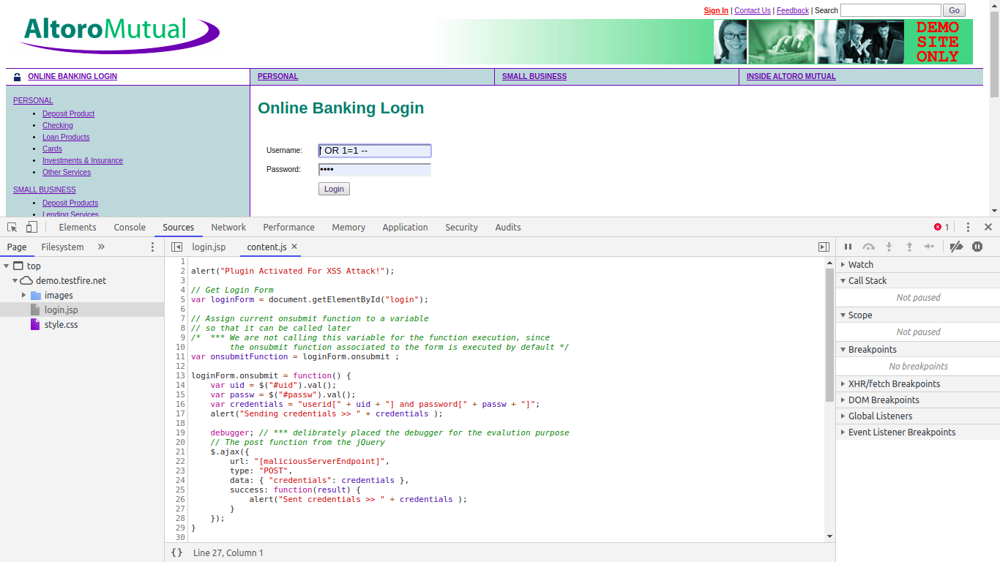

# XSS Attack For Non Logged-In User

## Introduction

Chrome extension is the tool that get associated to the browser in order to perform the specific task. To gain further information please refer this link https://developer.chrome.com/extensions.

## Note for placing `alert` and `debugger`

There are some delibrately placed `alert` and `debugger` for the evalution purpose. If we remove them, it would be not possible to unearth (discover) the attack.

## About Plugin

To perform the XSS attack, the chrome plugin is developed and after getting attached it looks like this:

## Plugin Structure

- manifest.json (Configuration File of the Plugin)
- content.js (Contains Malicious Code/Script)
- hacker.png (Plugin Icon)
- jquery.min.js (jQuery's Javascript File)
- link: [link](https://github.com/viveksacademia4git/InternetSecurity/tree/SQL-Injection-and-XSS/AngularXSS/lite-server/plugin)

The developed plugin specifically targets the 'Altoro Mutual' login web page and no other web site. Upon executing any other web site, this plugin does not gets activated, but only on the the 'Altoro Mutual' login webpage as follow:

It reads the login credentials entered by the user and sends the data before the user's login into web application.

Network call is executed by the malicious code using the `ajax` function from ***jQuery***

## Reference

Development Reference:
- https://blog.lateral.io/2016/04/create-chrome-extension-modify-websites-html-css/
- https://www.sitepoint.com/create-chrome-extension-10-minutes-flat/
