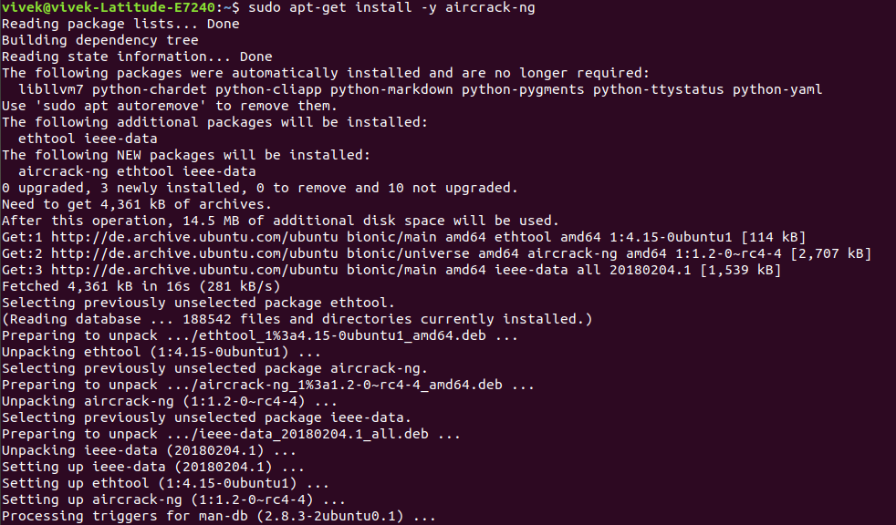
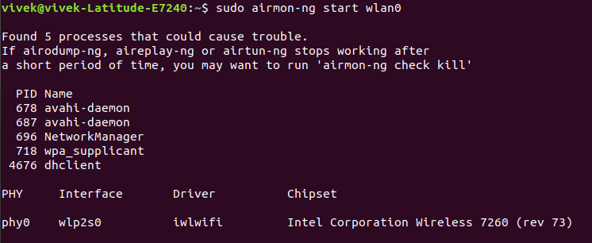
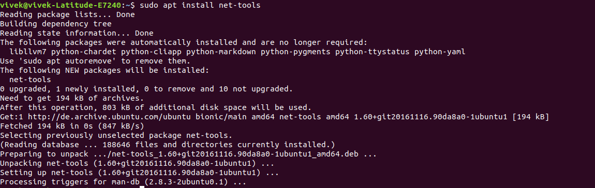
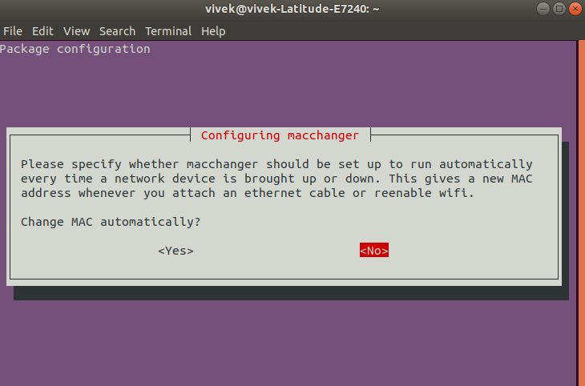

# Scan WEP Networks

### Install ***airmon-ng***

Command:  
`sudo apt-get install -y aircrack-ng`

Output Screenshot:  


Output Text:  
```
Reading package lists... Done
Building dependency tree       
Reading state information... Done
The following packages were automatically installed and are no longer required:
  libllvm7 python-chardet python-cliapp python-markdown python-pygments python-ttystatus python-yaml
Use 'sudo apt autoremove' to remove them.
The following additional packages will be installed:
  ethtool ieee-data
The following NEW packages will be installed:
  aircrack-ng ethtool ieee-data
0 upgraded, 3 newly installed, 0 to remove and 10 not upgraded.
Need to get 4,361 kB of archives.
After this operation, 14.5 MB of additional disk space will be used.
Get:1 http://de.archive.ubuntu.com/ubuntu bionic/main amd64 ethtool amd64 1:4.15-0ubuntu1 [114 kB]
Get:2 http://de.archive.ubuntu.com/ubuntu bionic/universe amd64 aircrack-ng amd64 1:1.2-0~rc4-4 [2,707 kB]
Get:3 http://de.archive.ubuntu.com/ubuntu bionic/main amd64 ieee-data all 20180204.1 [1,539 kB]                                                
Fetched 4,361 kB in 16s (281 kB/s)                                                                                                             
Selecting previously unselected package ethtool.
(Reading database ... 188542 files and directories currently installed.)
Preparing to unpack .../ethtool_1%3a4.15-0ubuntu1_amd64.deb ...
Unpacking ethtool (1:4.15-0ubuntu1) ...
Selecting previously unselected package aircrack-ng.
Preparing to unpack .../aircrack-ng_1%3a1.2-0~rc4-4_amd64.deb ...
Unpacking aircrack-ng (1:1.2-0~rc4-4) ...
Selecting previously unselected package ieee-data.
Preparing to unpack .../ieee-data_20180204.1_all.deb ...
Unpacking ieee-data (20180204.1) ...
Setting up ieee-data (20180204.1) ...
Setting up ethtool (1:4.15-0ubuntu1) ...
Setting up aircrack-ng (1:1.2-0~rc4-4) ...
Processing triggers for man-db (2.8.3-2ubuntu0.1) ...

```


### Check trouble causing process 

Command:  
`sudo airmon-ng start wlan0`

Output Screenshot:  


Output Text:  
```
Found 5 processes that could cause trouble.
If airodump-ng, aireplay-ng or airtun-ng stops working after
a short period of time, you may want to run 'airmon-ng check kill'

  PID Name
  678 avahi-daemon
  687 avahi-daemon
  696 NetworkManager
  718 wpa_supplicant
 4676 dhclient

PHY	Interface	Driver		Chipset

phy0	wlp2s0		iwlwifi		Intel Corporation Wireless 7260 (rev 73)
```


### Install ***net-tools***

Command:  
`sudo apt install net-tools`

Output Screenshot:  



Output Text:  
```
Reading package lists... Done
Building dependency tree       
Reading state information... Done
The following packages were automatically installed and are no longer required:
  libllvm7 python-chardet python-cliapp python-markdown python-pygments python-ttystatus python-yaml
Use 'sudo apt autoremove' to remove them.
The following NEW packages will be installed:
  net-tools
0 upgraded, 1 newly installed, 0 to remove and 10 not upgraded.
Need to get 194 kB of archives.
After this operation, 803 kB of additional disk space will be used.
Get:1 http://de.archive.ubuntu.com/ubuntu bionic/main amd64 net-tools amd64 1.60+git20161116.90da8a0-1ubuntu1 [194 kB]
Fetched 194 kB in 0s (847 kB/s)   
Selecting previously unselected package net-tools.
(Reading database ... 188646 files and directories currently installed.)
Preparing to unpack .../net-tools_1.60+git20161116.90da8a0-1ubuntu1_amd64.deb ...
Unpacking net-tools (1.60+git20161116.90da8a0-1ubuntu1) ...
Setting up net-tools (1.60+git20161116.90da8a0-1ubuntu1) ...
Processing triggers for man-db (2.8.3-2ubuntu0.1) ...
```


### Install ***Mac Changer***

Command:  
`sudo apt-get install macchanger`

Output Screenshot:  


MacAddress Changer Screenshot: Window Screenshot for Automatic Mac Address Assignment: (Preffered to Select 'No')  



Output Text:  
```
Reading package lists... Done
Building dependency tree       
Reading state information... Done
The following packages were automatically installed and are no longer required:
  libllvm7 python-chardet python-cliapp python-markdown python-pygments
  python-ttystatus python-yaml
Use 'sudo apt autoremove' to remove them.
The following NEW packages will be installed:
  macchanger
0 upgraded, 1 newly installed, 0 to remove and 10 not upgraded.
Need to get 190 kB of archives.
After this operation, 650 kB of additional disk space will be used.
Get:1 http://de.archive.ubuntu.com/ubuntu bionic/universe amd64 macchanger amd64 1.7.0-5.3build1 [190 kB]
Fetched 190 kB in 1s (178 kB/s)     
Preconfiguring packages ...
Selecting previously unselected package macchanger.
(Reading database ... 188694 files and directories currently installed.)
Preparing to unpack .../macchanger_1.7.0-5.3build1_amd64.deb ...
Unpacking macchanger (1.7.0-5.3build1) ...
Setting up macchanger (1.7.0-5.3build1) ...
Processing triggers for install-info (6.5.0.dfsg.1-2) ...
Processing triggers for man-db (2.8.3-2ubuntu0.1) ...
```


