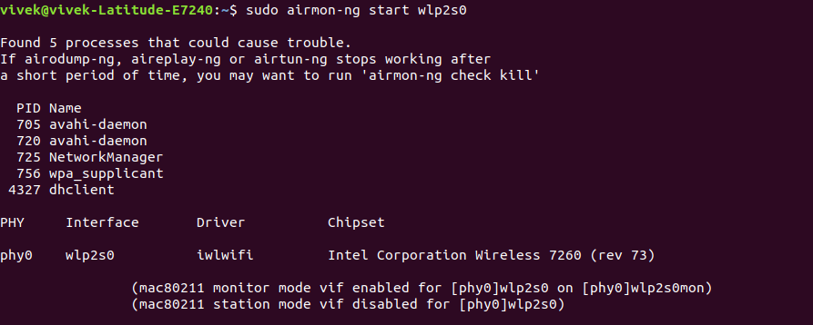

# Scan WEP Networks

## Install ***airmon-ng***

Command:  
`sudo apt-get install -y aircrack-ng`

Output Screenshot:  


Output Text:  
```
Reading package lists... Done
Building dependency tree       
Reading state information... Done
The following packages were automatically installed and are no longer required:
  libllvm7 python-chardet python-cliapp python-markdown python-pygments python-ttystatus python-yaml
Use 'sudo apt autoremove' to remove them.
The following additional packages will be installed:
  ethtool ieee-data
The following NEW packages will be installed:
  aircrack-ng ethtool ieee-data
0 upgraded, 3 newly installed, 0 to remove and 10 not upgraded.
Need to get 4,361 kB of archives.
After this operation, 14.5 MB of additional disk space will be used.
Get:1 http://de.archive.ubuntu.com/ubuntu bionic/main amd64 ethtool amd64 1:4.15-0ubuntu1 [114 kB]
Get:2 http://de.archive.ubuntu.com/ubuntu bionic/universe amd64 aircrack-ng amd64 1:1.2-0~rc4-4 [2,707 kB]
Get:3 http://de.archive.ubuntu.com/ubuntu bionic/main amd64 ieee-data all 20180204.1 [1,539 kB]                                                
Fetched 4,361 kB in 16s (281 kB/s)                                                                                                             
Selecting previously unselected package ethtool.
(Reading database ... 188542 files and directories currently installed.)
Preparing to unpack .../ethtool_1%3a4.15-0ubuntu1_amd64.deb ...
Unpacking ethtool (1:4.15-0ubuntu1) ...
Selecting previously unselected package aircrack-ng.
Preparing to unpack .../aircrack-ng_1%3a1.2-0~rc4-4_amd64.deb ...
Unpacking aircrack-ng (1:1.2-0~rc4-4) ...
Selecting previously unselected package ieee-data.
Preparing to unpack .../ieee-data_20180204.1_all.deb ...
Unpacking ieee-data (20180204.1) ...
Setting up ieee-data (20180204.1) ...
Setting up ethtool (1:4.15-0ubuntu1) ...
Setting up aircrack-ng (1:1.2-0~rc4-4) ...
Processing triggers for man-db (2.8.3-2ubuntu0.1) ...

```


## Check trouble causing process 

Command:  
`sudo airmon-ng start wlp2s0`

Output Screenshot:  


Output Text:  
```
Found 5 processes that could cause trouble.
If airodump-ng, aireplay-ng or airtun-ng stops working after
a short period of time, you may want to run 'airmon-ng check kill'

  PID Name
  705 avahi-daemon
  720 avahi-daemon
  725 NetworkManager
  756 wpa_supplicant
 4327 dhclient

PHY	Interface	Driver		Chipset

phy0	wlp2s0		iwlwifi		Intel Corporation Wireless 7260 (rev 73)

		(mac80211 monitor mode vif enabled for [phy0]wlp2s0 on [phy0]wlp2s0mon)
		(mac80211 station mode vif disabled for [phy0]wlp2s0)

Found 5 processes that could cause trouble.
If airodump-ng, aireplay-ng or airtun-ng stops working after
a short period of time, you may want to run 'airmon-ng check kill'

  PID Name
  678 avahi-daemon
  687 avahi-daemon
  696 NetworkManager
  718 wpa_supplicant
 4676 dhclient

PHY	Interface	Driver		Chipset

phy0	wlp2s0		iwlwifi		Intel Corporation Wireless 7260 (rev 73)
```


## Install ***net-tools*** for ***ifconfig***

Command:  
`sudo apt install net-tools`

Output Screenshot:  


Output Text:  
```
Reading package lists... Done
Building dependency tree       
Reading state information... Done
The following packages were automatically installed and are no longer required:
  libllvm7 python-chardet python-cliapp python-markdown python-pygments python-ttystatus python-yaml
Use 'sudo apt autoremove' to remove them.
The following NEW packages will be installed:
  net-tools
0 upgraded, 1 newly installed, 0 to remove and 10 not upgraded.
Need to get 194 kB of archives.
After this operation, 803 kB of additional disk space will be used.
Get:1 http://de.archive.ubuntu.com/ubuntu bionic/main amd64 net-tools amd64 1.60+git20161116.90da8a0-1ubuntu1 [194 kB]
Fetched 194 kB in 0s (847 kB/s)   
Selecting previously unselected package net-tools.
(Reading database ... 188646 files and directories currently installed.)
Preparing to unpack .../net-tools_1.60+git20161116.90da8a0-1ubuntu1_amd64.deb ...
Unpacking net-tools (1.60+git20161116.90da8a0-1ubuntu1) ...
Setting up net-tools (1.60+git20161116.90da8a0-1ubuntu1) ...
Processing triggers for man-db (2.8.3-2ubuntu0.1) ...
```


## Stop the Interface

Stop the interface for `[phy0]wlp2s0 on [phy0]wlp2s0mon`

Command:  
`sudo ifconfig wlp2s0mon down`


## Install ***Mac Changer***

Command:  
`sudo apt-get install macchanger`

Output Screenshot:  


MacAddress Changer Screenshot: Window Screenshot for Automatic Mac Address Assignment: (Preffered to Select 'No')  


Output Text:  
```
Reading package lists... Done
Building dependency tree       
Reading state information... Done
The following packages were automatically installed and are no longer required:
  libllvm7 python-chardet python-cliapp python-markdown python-pygments
  python-ttystatus python-yaml
Use 'sudo apt autoremove' to remove them.
The following NEW packages will be installed:
  macchanger
0 upgraded, 1 newly installed, 0 to remove and 10 not upgraded.
Need to get 190 kB of archives.
After this operation, 650 kB of additional disk space will be used.
Get:1 http://de.archive.ubuntu.com/ubuntu bionic/universe amd64 macchanger amd64 1.7.0-5.3build1 [190 kB]
Fetched 190 kB in 1s (178 kB/s)     
Preconfiguring packages ...
Selecting previously unselected package macchanger.
(Reading database ... 188694 files and directories currently installed.)
Preparing to unpack .../macchanger_1.7.0-5.3build1_amd64.deb ...
Unpacking macchanger (1.7.0-5.3build1) ...
Setting up macchanger (1.7.0-5.3build1) ...
Processing triggers for install-info (6.5.0.dfsg.1-2) ...
Processing triggers for man-db (2.8.3-2ubuntu0.1) ...
```


## Use Mac Changer for changing Mac-Address

Command:  
`sudo macchanger wlp2s0mon 00:11:22:33:44:55`

Output Screenshot:  


Output Text:  
```
Current MAC:   ac:7b:a1:84:eb:d5 (Intel Corporate)
Permanent MAC: ac:7b:a1:84:eb:d5 (Intel Corporate)
```


### Start the Interface

Stop the interface for `[phy0]wlp2s0 on [phy0]wlp2s0mon`

Command:  
`sudo ifconfig wlp2s0mon down`


## Start Monitoring through 'airodump-ng'

Command:  
`sudo airodump-ng wlp2s0mon`

Output Screenshot:  


Output Text:  
``` CH  8 ][ Elapsed: 30 s ][ 2019-10-28 19:26                                         
                                                                                                                                               
 BSSID              PWR  Beacons    #Data, #/s  CH  MB   ENC  CIPHER AUTH ESSID
                                                                                                                                               
 A0:E0:AF:A0:E9:AE   -1        0        0    0  11  -1                    <length:  0>                                                         
 60:E3:27:4D:A2:88  -45       36        0    0   7  54e. WPA2 CCMP   PSK  Wifi_Register                                                        
 A0:E0:AF:D5:7B:42  -48       15        0    0  11  54e. WPA2 CCMP   MGT  eduroam                                                              
 A0:E0:AF:D5:7B:41  -48       11      143    0  11  54e. WPA2 CCMP   MGT  wlanfh1x                                                             
 A0:E0:AF:D5:7B:43  -49       15        0    0  11  54e. WPA2 CCMP   PSK  HSHD-SAP                                                              
 A0:E0:AF:D5:7B:40  -49       18        0    0  11  54e. WPA2 CCMP   MGT  SRH                                                                   
 E8:94:F6:F2:F1:E1  -60       52        2    0   6  54e. WEP  WEP         to_break_educational                                                  
 A0:E0:AF:E8:BB:93  -66       16        0    0   1  54e. WPA2 CCMP   PSK  HSHD-SAP                                                              
 A0:E0:AF:E8:BB:92  -67       17        0    0   1  54e. WPA2 CCMP   MGT  eduroam                                                               
 A0:E0:AF:E8:BB:90  -67       19        0    0   1  54e. WPA2 CCMP   MGT  SRH                                                                   
 A0:E0:AF:E8:BB:91  -67       18     3011    0   1  54e. WPA2 CCMP   MGT  wlanfh1x                                                             
 A0:E0:AF:D6:58:D0  -73       15        0    0   6  54e. WPA2 CCMP   MGT  SRH                                                                   
 A0:E0:AF:D6:58:D3  -73       15        0    0   6  54e. WPA2 CCMP   PSK  HSHD-SAP                                                              
 A0:E0:AF:D6:58:D1  -74       15        0    0   6  54e. WPA2 CCMP   MGT  wlanfh1x                                                              
 A0:E0:AF:B4:1C:A3  -74       10        0    0   1  54e. WPA2 CCMP   PSK  HSHD-SAP                                                             
 A0:E0:AF:D6:58:D2  -75       13        0    0   6  54e. WPA2 CCMP   MGT  eduroam                                                               
 AC:84:C6:58:46:F8  -75        2        0    0   9  54e. WPA2 CCMP   PSK  <length:  0>                                                          
 A0:E0:AF:B4:1C:A0  -75        9        0    0   1  54e. WPA2 CCMP   MGT  SRH                                                                   
 A0:E0:AF:B4:1C:A2  -75        4        0    0   1  54e. WPA2 CCMP   MGT  eduroam                                                               
 A0:E0:AF:B4:1C:A1  -75       10        0    0   1  54e. WPA2 CCMP   MGT  wlanfh1x                                                              
 A0:E0:AF:A0:E9:A3  -75       12        0    0   1  54e. WPA2 CCMP   PSK  HSHD-SAP                                                              
 A0:E0:AF:A0:E9:A0  -75        9        0    0   1  54e. WPA2 CCMP   MGT  SRH                                                                   
 A0:E0:AF:A0:EA:00  -76       11        0    0   6  54e. WPA2 CCMP   MGT  SRH                                                                   
 A0:E0:AF:B2:E8:11  -76       15        0    0  11  54e. WPA2 CCMP   MGT  wlanfh1x                                                              
 A0:E0:AF:B2:E8:13  -76       13        0    0  11  54e. WPA2 CCMP   PSK  HSHD-SAP                                                              
 A0:E0:AF:A0:EA:01  -76       15        0    0   6  54e. WPA2 CCMP   MGT  wlanfh1x                                                              
 A0:E0:AF:A0:EA:03  -76       14        0    0   6  54e. WPA2 CCMP   PSK  HSHD-SAP                                                              
 A0:E0:AF:A0:EA:02  -76       14        0    0   6  54e. WPA2 CCMP   MGT  eduroam                                                               
 A0:E0:AF:A0:E9:A2  -76        8        0    0   1  54e. WPA2 CCMP   MGT  eduroam                                                               
 A0:E0:AF:A0:E9:A1  -76       11        0    0   1  54e. WPA2 CCMP   MGT  wlanfh1x                                                             
 A0:E0:AF:B2:E8:10  -77       13        0    0  11  54e. WPA2 CCMP   MGT  SRH                                                                  
 A0:E0:AF:B2:E8:12  -77       14        0    0  11  54e. WPA2 CCMP   MGT  eduroam 
```

## Monitoring Table Header Explanation:

***BSSID:***
"Packets bound for devices within the WLAN need to go to the correct destination. The SSID keeps the packets within the correct WLAN, even when overlapping WLANs are present. However, there are usually multiple access points within each WLAN, and there has to be a way to identify those access points and their associated clients. This identifier is called a basic service set identifier (BSSID) and is included in all wireless packets."[Link:juniper.net](https://www.juniper.net/documentation/en_US/junos-space-apps/network-director3.5/topics/concept/wireless-ssid-bssid-essid.html)  

***ENC:***
Type of encryption used for the network.

***CIPHER:***
Type of CIPHER used for the network.


## WEP 'to_break_educational'

The WEP with the assigned name `to_break_educational` has BSSID `E8:94:F6:F2:F1:E1` which signifies that the security being used by the network is `WEP 40/128-bit Key(Hex or ASCII`.


## References

- https://www.juniper.net/documentation/en_US/junos-space-apps/network-director3.5/topics/concept/wireless-ssid-bssid-essid.html