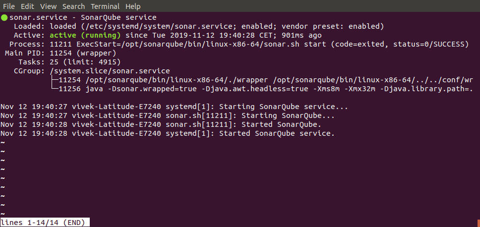
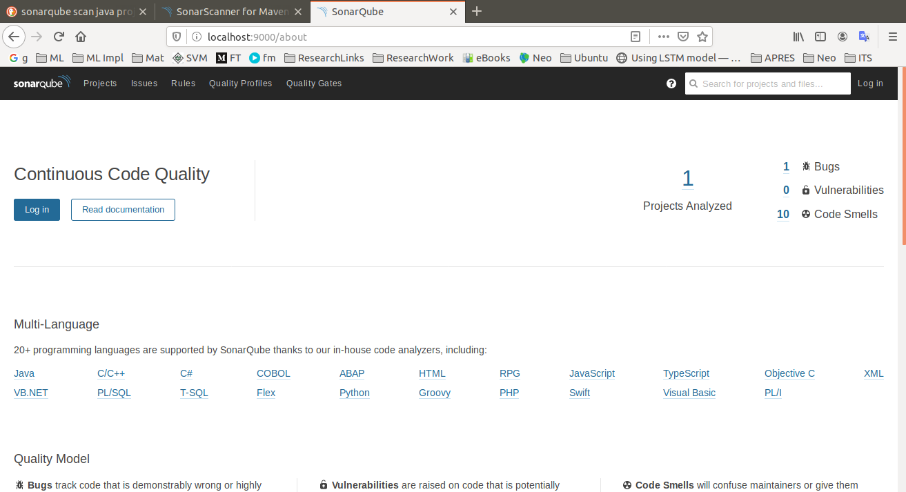
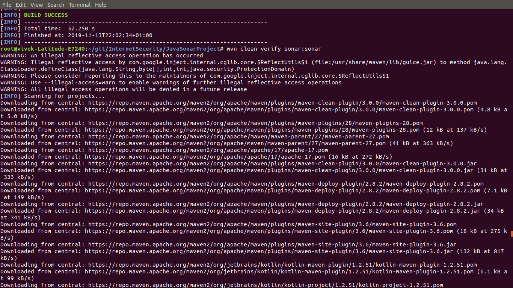
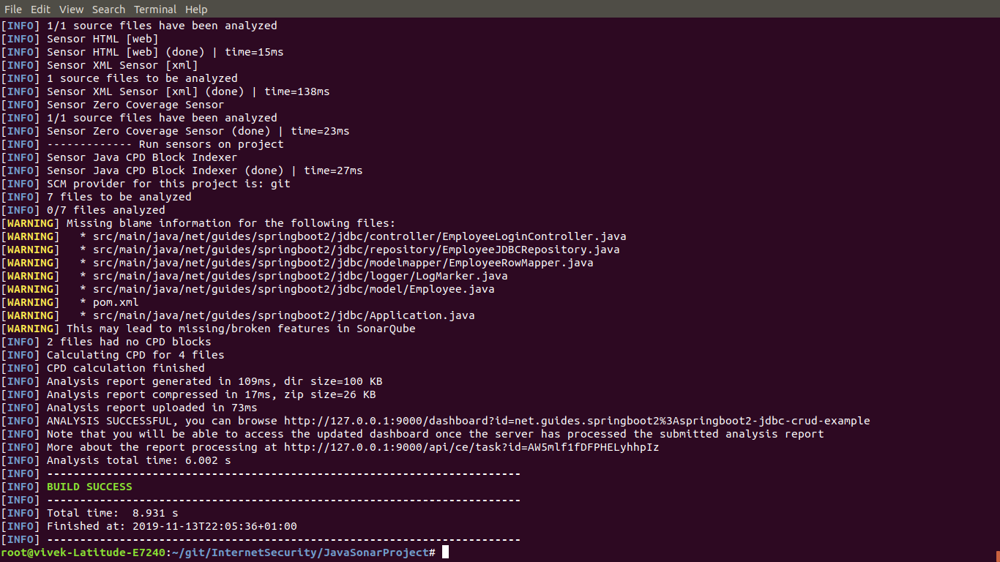
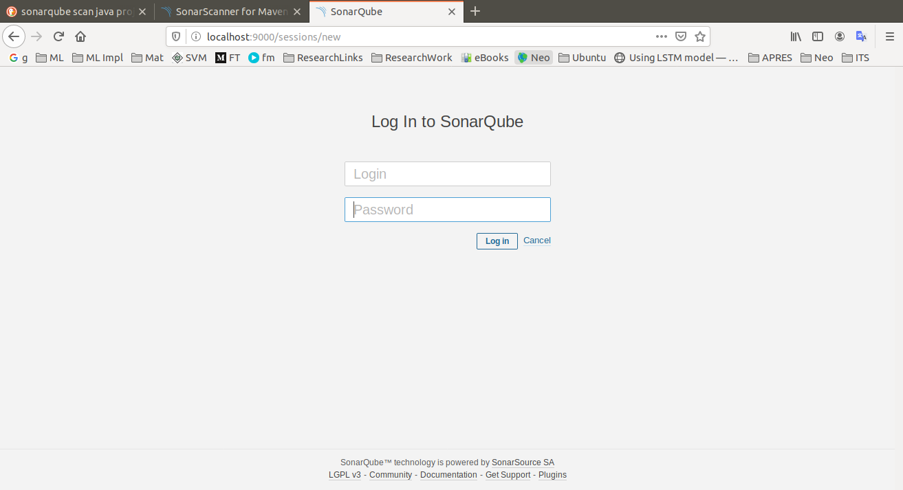
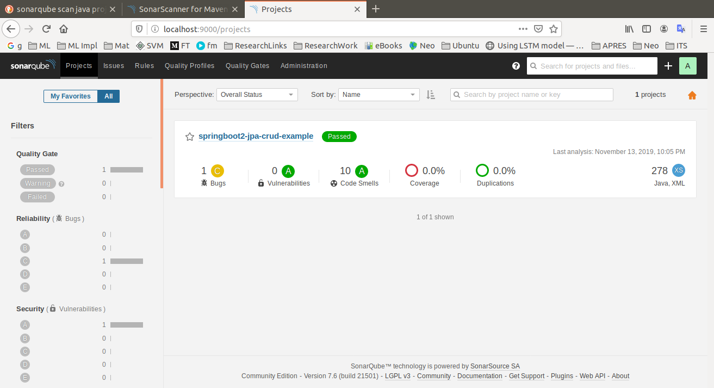

# SonarQube Scanner


## Install Sonar

I followed the instruction from the website in order to install SonarQube Scanner for the Linux Env: https://www.howtoforge.com/how-to-install-sonarqube-on-ubuntu-1804/


After following the instructions from the mentioned web, the SonarQube Scanner is installed as service. We can start the sonar service to have it ready for project scanning running on port 9000:  


Check whether SonarQube installation has been successful by executing the URL http://localhost:9000  



## Maven Dependency

Using ***[pom.xml](pom.xml)***, install SonarQube Dependency and configure your project to have it scanned by SonarQube.  
```
<?xml version="1.0" encoding="UTF-8"?>
<project xmlns="http://maven.apache.org/POM/4.0.0"
	xmlns:xsi="http://www.w3.org/2001/XMLSchema-instance"
	xsi:schemaLocation="http://maven.apache.org/POM/4.0.0 http://maven.apache.org/xsd/maven-4.0.0.xsd">
	<modelVersion>4.0.0</modelVersion>
	
	...
	...
	...

	<dependencies>
		...
		...

		<dependency>
			<groupId>org.sonarsource.scanner.maven</groupId>
			<artifactId>sonar-maven-plugin</artifactId>
			<version>3.2</version>
		</dependency>

		...
		...
	</dependencies>

	<profiles>
		<profile>
			<id>sonar</id>
			<activation>
				<activeByDefault>true</activeByDefault>
			</activation>
			<properties>
				<!-- Optional URL to server. Default value is http://localhost:9000 -->
				<sonar.host.url>http://127.0.0.1:9000</sonar.host.url>
			</properties>
		</profile>
	</profiles>

</project>
```


## Execute Project Scanning

Please make sure that the SonarQube Scanner is up and running (like screenshot from **Install Sonar** section) before executing the command for SonarQube to perform project scanning.


Go to the project location and execute the following command from the terminal:
```
mvn sonar:sonar
```

Output of the program:
```
WARNING: An illegal reflective access operation has occurred
WARNING: Illegal reflective access by com.google.inject.internal.cglib.core.$ReflectUtils$1 (file:/usr/share/maven/lib/guice.jar) to method java.lang.ClassLoader.defineClass(java.lang.String,byte[],int,int,java.security.ProtectionDomain)
WARNING: Please consider reporting this to the maintainers of com.google.inject.internal.cglib.core.$ReflectUtils$1
WARNING: Use --illegal-access=warn to enable warnings of further illegal reflective access operations
WARNING: All illegal access operations will be denied in a future release
[INFO] Scanning for projects...
[WARNING] The POM for org.eclipse.m2e:lifecycle-mapping:jar:1.0.0 is missing, no dependency information available
[WARNING] Failed to retrieve plugin descriptor for org.eclipse.m2e:lifecycle-mapping:1.0.0: Plugin org.eclipse.m2e:lifecycle-mapping:1.0.0 or one of its dependencies could not be resolved: Failure to find org.eclipse.m2e:lifecycle-mapping:jar:1.0.0 in https://repo.maven.apache.org/maven2 was cached in the local repository, resolution will not be reattempted until the update interval of central has elapsed or updates are forced
[INFO] 
[INFO] --------< net.guides.springboot2:springboot2-jdbc-crud-example >--------
[INFO] Building springboot2-jpa-crud-example 0.0.1-SNAPSHOT
[INFO] --------------------------------[ jar ]---------------------------------
[WARNING] The POM for org.eclipse.m2e:lifecycle-mapping:jar:1.0.0 is missing, no dependency information available
[WARNING] Failed to retrieve plugin descriptor for org.eclipse.m2e:lifecycle-mapping:1.0.0: Plugin org.eclipse.m2e:lifecycle-mapping:1.0.0 or one of its dependencies could not be resolved: Failure to find org.eclipse.m2e:lifecycle-mapping:jar:1.0.0 in https://repo.maven.apache.org/maven2 was cached in the local repository, resolution will not be reattempted until the update interval of central has elapsed or updates are forced
[INFO] 
[INFO] --- sonar-maven-plugin:3.7.0.1746:sonar (default-cli) @ springboot2-jdbc-crud-example ---
[INFO] User cache: /root/.sonar/cache
[INFO] SonarQube version: 7.6.0
[INFO] Default locale: "en_US", source code encoding: "UTF-8"
[INFO] Load global settings
[INFO] Load global settings (done) | time=101ms
[INFO] Server id: A7EE8CF2-AW5hEY-uflLNwCYI0hVp
[INFO] User cache: /root/.sonar/cache
[INFO] Load/download plugins
[INFO] Load plugins index
[INFO] Load plugins index (done) | time=53ms
[INFO] Load/download plugins (done) | time=97ms
[INFO] Process project properties
[INFO] Execute project builders
[INFO] Execute project builders (done) | time=5ms
[INFO] Project key: net.guides.springboot2:springboot2-jdbc-crud-example
[INFO] Base dir: /home/vivek/git/InternetSecurity/JavaSonarProject
[INFO] Working dir: /home/vivek/git/InternetSecurity/JavaSonarProject/target/sonar
[INFO] Load project settings
[INFO] Load project settings (done) | time=55ms
[INFO] Load project repositories
[INFO] Load project repositories (done) | time=82ms
[INFO] Load quality profiles
[INFO] Load quality profiles (done) | time=38ms
[INFO] Load active rules
[INFO] Load active rules (done) | time=894ms
[INFO] Load metrics repository
[INFO] Load metrics repository (done) | time=32ms
[INFO] Indexing files...
[INFO] Project configuration:
[INFO] 7 files indexed
[INFO] Quality profile for java: Sonar way
[INFO] Quality profile for xml: Sonar way
[INFO] ------------- Run sensors on module springboot2-jpa-crud-example
[INFO] Sensor JavaSquidSensor [java]
[INFO] Configured Java source version (sonar.java.source): 8
[INFO] JavaClasspath initialization
[INFO] JavaClasspath initialization (done) | time=16ms
[INFO] JavaTestClasspath initialization
[INFO] JavaTestClasspath initialization (done) | time=4ms
[INFO] Java Main Files AST scan
[INFO] 6 source files to be analyzed
[INFO] 6/6 source files have been analyzed
[INFO] Java Main Files AST scan (done) | time=1276ms
[INFO] Java Test Files AST scan
[INFO] 0 source files to be analyzed
[INFO] 0/0 source files have been analyzed
[INFO] Java Test Files AST scan (done) | time=1ms
[INFO] Sensor JavaSquidSensor [java] (done) | time=1948ms
[INFO] Sensor JaCoCo XML Report Importer [jacoco]
[INFO] Sensor JaCoCo XML Report Importer [jacoco] (done) | time=3ms
[INFO] Sensor SurefireSensor [java]
[INFO] parsing [/home/vivek/git/InternetSecurity/JavaSonarProject/target/surefire-reports]
[INFO] Sensor SurefireSensor [java] (done) | time=2ms
[INFO] Sensor JaCoCoSensor [java]
[INFO] Sensor JaCoCoSensor [java] (done) | time=1ms
[INFO] Sensor JavaXmlSensor [java]
[INFO] 1 source files to be analyzed
[INFO] Sensor JavaXmlSensor [java] (done) | time=272ms
[INFO] 1/1 source files have been analyzed
[INFO] Sensor HTML [web]
[INFO] Sensor HTML [web] (done) | time=15ms
[INFO] Sensor XML Sensor [xml]
[INFO] 1 source files to be analyzed
[INFO] Sensor XML Sensor [xml] (done) | time=138ms
[INFO] Sensor Zero Coverage Sensor
[INFO] 1/1 source files have been analyzed
[INFO] Sensor Zero Coverage Sensor (done) | time=23ms
[INFO] ------------- Run sensors on project
[INFO] Sensor Java CPD Block Indexer
[INFO] Sensor Java CPD Block Indexer (done) | time=27ms
[INFO] SCM provider for this project is: git
[INFO] 7 files to be analyzed
[INFO] 0/7 files analyzed
[WARNING] Missing blame information for the following files:
[WARNING]   * src/main/java/net/guides/springboot2/jdbc/controller/EmployeeLoginController.java
[WARNING]   * src/main/java/net/guides/springboot2/jdbc/repository/EmployeeJDBCRepository.java
[WARNING]   * src/main/java/net/guides/springboot2/jdbc/modelmapper/EmployeeRowMapper.java
[WARNING]   * src/main/java/net/guides/springboot2/jdbc/logger/LogMarker.java
[WARNING]   * src/main/java/net/guides/springboot2/jdbc/model/Employee.java
[WARNING]   * pom.xml
[WARNING]   * src/main/java/net/guides/springboot2/jdbc/Application.java
[WARNING] This may lead to missing/broken features in SonarQube
[INFO] 2 files had no CPD blocks
[INFO] Calculating CPD for 4 files
[INFO] CPD calculation finished
[INFO] Analysis report generated in 109ms, dir size=100 KB
[INFO] Analysis report compressed in 17ms, zip size=26 KB
[INFO] Analysis report uploaded in 73ms
[INFO] ANALYSIS SUCCESSFUL, you can browse http://127.0.0.1:9000/dashboard?id=net.guides.springboot2%3Aspringboot2-jdbc-crud-example
[INFO] Note that you will be able to access the updated dashboard once the server has processed the submitted analysis report
[INFO] More about the report processing at http://127.0.0.1:9000/api/ce/task?id=AW5mlf1fDFPHELyhhpIz
[INFO] Analysis total time: 6.002 s
[INFO] ------------------------------------------------------------------------
[INFO] BUILD SUCCESS
[INFO] ------------------------------------------------------------------------
[INFO] Total time:  8.931 s
[INFO] Finished at: 2019-11-13T22:05:36+01:00
[INFO] ------------------------------------------------------------------------
```

Screenshots:

  




## Check Scanning Result in SonarQube browser

Login to the SonarQube browser:  
  

After login you may view you project's result for various attributes, like coding standards, bugs, code smell, and vulnerabilities:  
  


## References

1. https://www.howtoforge.com/how-to-install-sonarqube-on-ubuntu-1804/
2. https://docs.sonarqube.org/latest/analysis/scan/sonarscanner-for-maven/