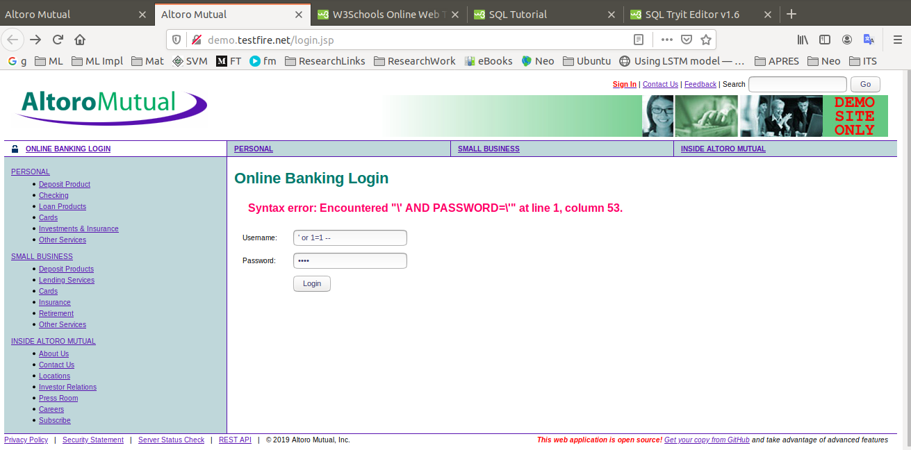
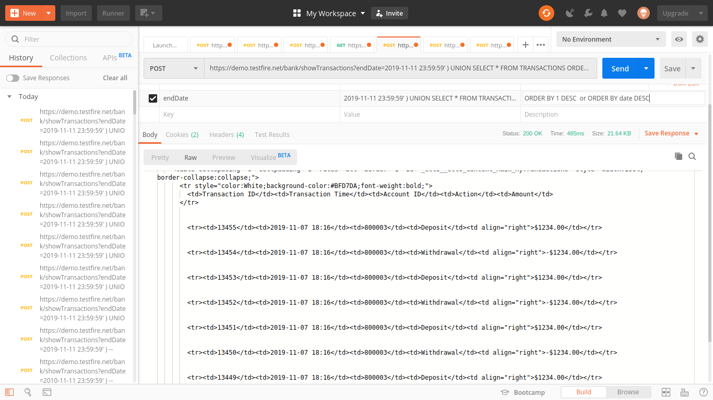
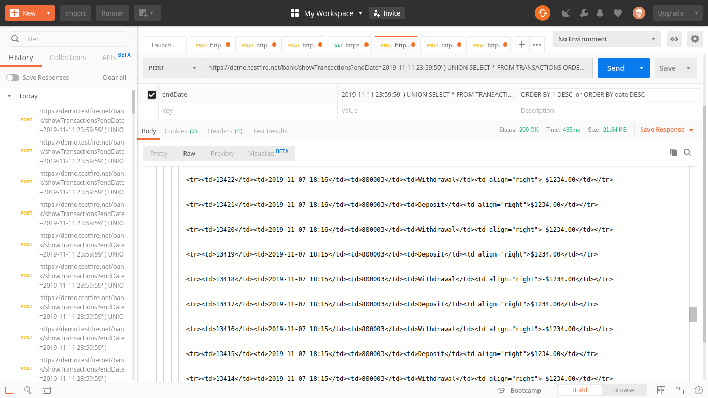
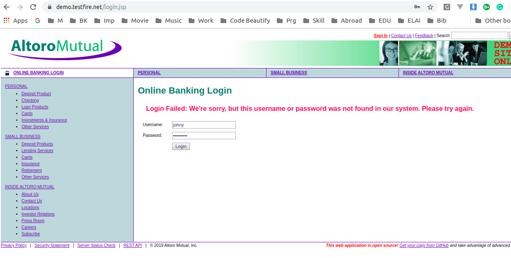
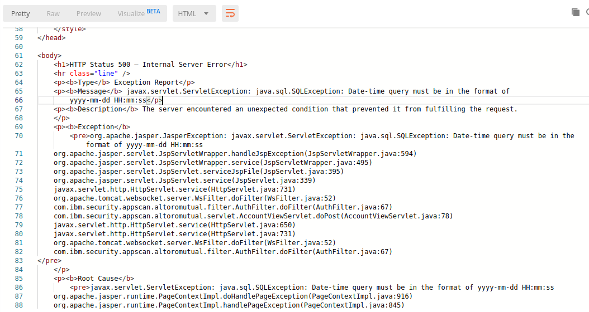

# Conduct SQL Injection on Altoro Mutual

## Use a SQL-Injection to log in as admin user

First we will check whether or not SQL Injection is possible. We have used the following credentials to login.
 - Username: ' or 1=1 --
 - Password: 1234  
 
**``` .........Input 1 ```**




Lets assume that the query executed on the server is something similar to
```
SELECT * FROM [some_users_table] WHERE username='[input_username]' AND password='[input_password]' ...;
```
**``` .........Query 1 ```**

After executing the above steps, we conclude that the SQL Injection vulnerability can be exploited on the web application. 

Now after we send credentials to the server, through the login process, the assummed query formed on the server's web application might be:
```
SELECT * FROM [some_users_table] WHERE username='' OR 1=1 -- AND password='[input_password]' ...;
```
**``` .........Query 2 ```**

The result (output of SQL query exection) of the manipulated Query 2, through SQL Injection, will return the list (rows) of all the users. From these respective records, one of the record (probabily the first record) is picked up the application's code section, for user authentication, to provide free passage within the application.

## 1. How can you circumvent the check for a correct password?

In order to circumvent the check for the correct password we have used the (`--`) comment from SQL, which actually comments all the characters that comes after the SQL comment. So the only condition adhered after adding the comment is, what comes after `WHERE` SQL keyword and before the SQL comment. The SQL Injection conducted for the user authentication manipulates the condition from {***Check for the correct >> username and password***} to {***Check > if the username is correct or if the condition 1=1 is true***}, which will be always true irrespective of providing the correct username or not.

**Login as the other user**
In order to change the user we can enter the username as `' OR 1=1 ORDER BY 1 DESC --` or `' OR 1=1 ORDER BY 1 ASC --`.


## 2. How does the WHERE clause of the SQL statement used for the login look like?

It looks exactly like ***Query 1*** without SQL Injection, and it looks like ***Query 2*** after SQL Injection


## 3. After you successfully logged in: How can you use a SQL-Injection to show all recent transactions of all users?

We will use make use of the ***POSTMAN*** application to exploit the SQL Injection vulnerability to fetch all the transactions from all the user.

In order to show the transaction for all users we can use make of the `UNION` keyword from SQL. It is responsible for fetching all the records by performing union (as second half of any query) with the same table. We are making union of `TRANSACTIONS` table by having two parts of a query by performing the following SQLInjection:  
`https://demo.testfire.net/bank/transaction.jsp?endDate=2019-11-11 23:59:59' UNION SELECT * FROM TRANSACTIONS order by accountid; --`

Query before SQL Injection the query will look somewhat like this:
```
SELECT * FROM TRANSACTION
WHERE ...[SOME CONDITION]... AND [date] < '2019-11-11 23:59:59'
...[MAYBE SOME ORDER BY]...
...[MAYBE SOME LIMIT]...
```
**``` .........Query 3 ```**


Query after SQL Injection the query will look somewhat like this:
```
SELECT * FROM TRANSACTION
WHERE ...[SOME CONDITION]... AND [date] < '2019-11-11 23:59:59'
UNION
SELECT * FROM TRANSACTIONS ORDER BY 1 DESC -- or > ORDER BY date DESC (show latest records)
```
**``` .........Query 4 ```**

The query (Query 4) from the outcome of SQL Injection with `UNION` keyword will fetch all the recend records for all users without associating any condition, so the purview of result-set (records from table) in general will be equivalent to the `SELECT * FROM TRANSACTIONS ORDER BY 1 -- or > ORDER BY date DESC ` plus extra records fetched using the first half of the union query (Query 3) that comes before `UNION` keyword.

Screenshot:



Screenshot (With time difference):



***Note***: I checked the [GitHub repository of AltoroJ](https://github.com/hclproducts/AltoroJ/tree/AltoroJ-3.2) to get the table name, but in real life the attacker can only make guess of the table name (in this 'TRANSACTIONS') which can known after performing the few unsuccessful attempts. I would also like to highlight the fact that I was unable to login after creating a user:  
  
It is also possible that the user is not getting created by the application in the database.


## 4. Is the vulnerability susceptible to normal SQL-Injections or to blind SQL-Injections? Justify your answer and state the difference between the two.

It is type of SQL Injection vulnerability that we are trying to leverage on the web application is ***blind SQL Injection***, since the error message is very precise with no information what so ever revealed in the error message about the web application or the schema of the database.

Even the error messages on the server's end, displayed on the front end, conceal the business logic and database schema, but it is disclosing the date-time format.  

