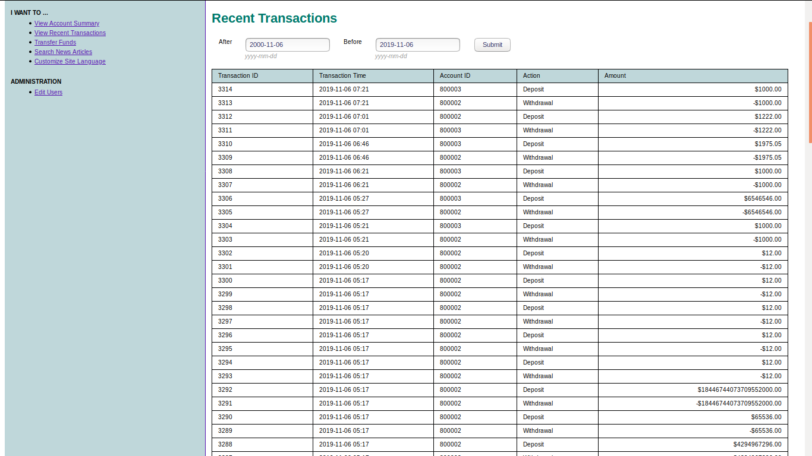

# Conduct SQL Injection on Altoro Mutual

## Use a SQL-Injection to log in as admin user

First we will check whether or not SQL Injection is possible. We have used the following credentials to login.
 - Username: ' or 1=1 --
 - Password: 1234  
<div style="text-align: right"> ...Input 1 </div>


Lets assume that the query executed on the server is something similar to
```
SELECT * FROM [some_users_table] WHERE username='[input_username]' AND password='[input_password]' ...;
```
<div style="text-align: right"> ...Query 1 </div>

Now after we send credentials to the server, through the login process, the assummed query formed on the server's web application might be:
```
SELECT * FROM [some_users_table] WHERE username='' OR 1=1 -- AND password='[input_password]' ...;
```
<div style="text-align: right"> ...Query 2 </div>

The result (output of SQL query exection) of the manipulated Query 2, through SQL Injection, will return the list (rows) of all the users. From these respective records, one of the record (probabily the first record) is picked up the application's code section, for user authentication, to provide free passage within the application.

## 1. How can you circumvent the check for a correct password? (1P)

In order to circumvent the check for the correct password we have used the (`--`) comment from SQL, which actually comments all the characters that comes after the SQL comment. So the only condition adhered after adding the comment is, what comes after `WHERE` SQL keyword and before the SQL comment. The SQL Injection conducted for the user authentication manipulates the condition from {***Check for the correct >> username and password***} to {***Check > if the username is correct or if the condition 1=1 is true***}, which will be always true irrespective of providing the correct username or not.


## How does the WHERE clause of the SQL statement used for the login look like? (1P)

It looks exactly like ***Query 1*** without SQL Injection, and it looks like ***Query 2*** after SQL Injection


## After you successfully logged in: How can you use a SQL-Injection to show all recent transactions of all users? (2P)

Since we are logged in as an admin user therefore we are able to view all the transaction performed by all the users.



But we will use the SQL Injection to fetch all the recent records.
