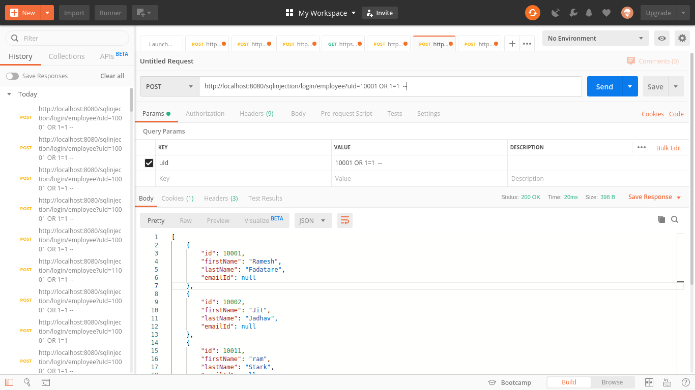
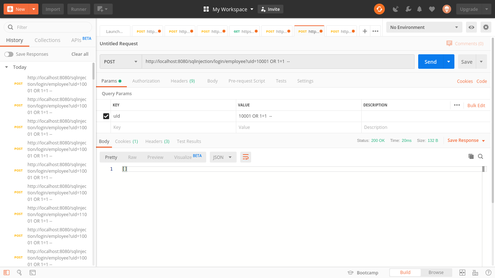

# SQL Injection

## Process to execute the project

- Pull the repository and import the `spring-boot-tutorial` project. Add Java and Maven nature if not added, to the project.
- Run the [Application.java](../src/main/java/net/guides/springboot2/jdbc/Application.java) file within `net.guides.springboot2.jdbc` package.
- Project get exeucted on the Tomcat Server via spring-boot on the default port 8080.

## SQL Injection

- In order to perform our task we have used the POSTMAN application to perform HTTP request.
- The SQL Injection can be performed by execution of the URL: `http://localhost:8080/sqlinjection/login/employee?uId=10001 OR 1=1`
- Ideally, it should only return only one Employee record but due to the SQL Injection it returns list of Employee.
- Vulnerable Source Code (package: net.guides.springboot2.jdbc.controller) (class:EmployeeLoginController.java) (function:findByIdVulnerable)
- The input parameter is concatenated directly to the query, hence exploitation is leveraged.
Screenshot

## SQL Injection Removed

- Non Vulnerable Source Code (package: net.guides.springboot2.jdbc.controller) (class:EmployeeLoginController.java) (function:findByIdNonVulnerable)
- The Integer parameter received as an input is verified, before passing the parameter to the query. These adds an extra layer of security before processing the SQL query.
- The conditional string concatenation to the query is replaced with `?` character that does not allow SQL-Injection (The spring library escapes any of the  single quote `'` character from parameter passed to the query, even if the string is passed to the query. In short it acts as `setParameter` function from the `java.sql.PreparedStatement`).

Screenshot
